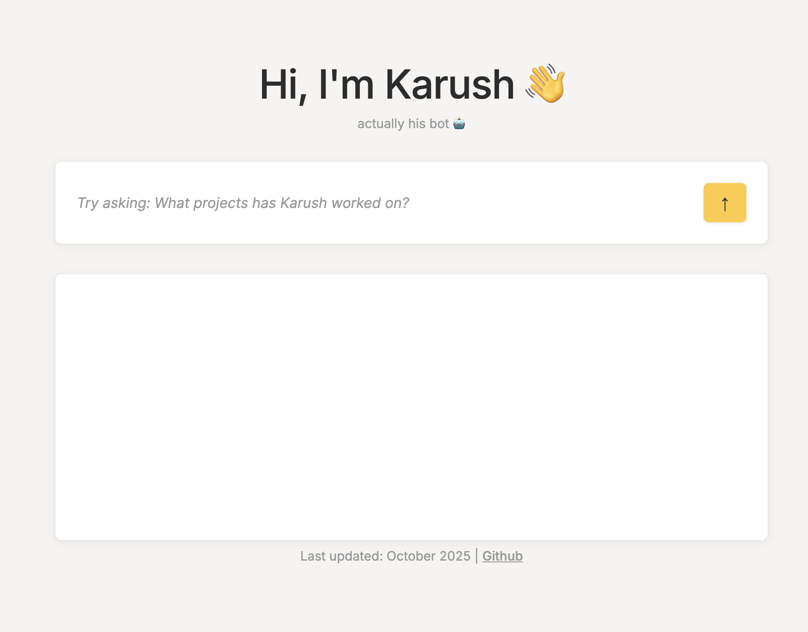

# Resume Chatbot

A conversational AI chatbot that answers questions about my resume. Built with Python, Flask, and modern AI APIs.

🔗 **[Live Demo](https://karushp.github.io/resume-chatbot)**

## Features

- **Conversational AI**: Natural, engaging responses powered by Groq's Llama model
- **Smart Search**: Uses Cohere embeddings to find relevant resume information
- **Modern UI**: Clean, responsive chat interface
- **Fast Performance**: Optimized for quick responses

## Tech Stack

- **Frontend**: HTML, CSS, JavaScript
- **Backend**: Python, Flask
- **AI**: Groq API (Llama 3.1), Cohere Embeddings
- **Deployment**: GitHub Pages + Render

## How It Works

1. User asks a question about my experience
2. System searches through my resume using AI embeddings
3. Relevant information is sent to Groq's AI model
4. AI generates a natural, conversational response

---

*Built as a portfolio project to showcase AI integration and full-stack development skills.*