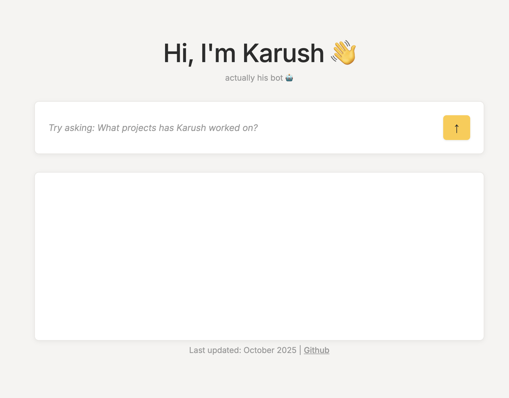

# Resume Chatbot

Interactive portfolio chatbot that answers questions about my professional background using RAG (markdown resume + embeddings + LLM).

🔗 **[Live Demo](https://karushp.github.io/resume-chatbot)**



## Features

- Conversational Q&A over a structured markdown resume
- Semantic retrieval with Cohere embeddings + FAISS
- Responses via Groq chat models
- Chat history (last 4 messages), rate limiting, and safe frontend rendering
- Cookie consent + privacy policy for analytics

## Tech Stack

| Layer | Stack |
|---|---|
| Frontend | HTML, CSS, JavaScript (GitHub Pages) |
| Backend | Python, Flask (Render) |
| AI | Groq + Cohere Embeddings + FAISS |

## Project Structure

```text
resume-chatbot/
├── index.html              # GitHub Pages entry
├── privacy.html
├── frontend/               # UI assets (CSS, JS, photo)
├── backend/
│   ├── app.py              # Flask API + RAG pipeline
│   ├── config.py           # Prompt, model, and limits (edit here)
│   ├── data/karush_resume.md
│   ├── requirements.txt
│   └── README.md           # Backend setup details
├── img/                    # README screenshots
└── Dockerfile              # Backend container for Render
```

## Quick Start (local)

### Backend

```bash
cd backend
cp .env.example .env   # add GROQ_API_KEY and COHERE_API_KEY
python -m venv .venv && source .venv/bin/activate
pip install -r requirements.txt
KMP_DUPLICATE_LIB_OK=TRUE python app.py
```

API: `http://127.0.0.1:5001/ask`

### Frontend

```bash
# from repo root
python -m http.server 8080
```

Open `http://127.0.0.1:8080` — on localhost the UI calls the local API automatically.

## Configuration

Edit [`backend/config.py`](backend/config.py) for:

- System prompt and personal details
- Groq model / temperature
- Retrieval and rate-limit settings
- Resume markdown path

Resume source of truth: [`backend/data/karush_resume.md`](backend/data/karush_resume.md)

## Deployment

- **Frontend:** GitHub Pages (this repo)
- **Backend:** Render via `Dockerfile` (set `GROQ_API_KEY` and `COHERE_API_KEY`)

---

*Portfolio project showcasing RAG, API design, and a polished chat UI.*
